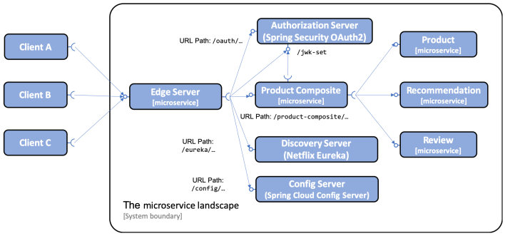

# There is an Microservices Architecture of my project

1. HTTPS is used for external communication, while plain text HTTP is used inside the system landscape.
2. The local OAuth 2.0 authorization server will be accessed externally through the edge server.
3. Both the edge server and the product composite microservice will validate access tokens as signed JWT tokens.
4. The edge server and the product composite microservice will get the authorization server's public keys from its jwk-set endpoint, and use them to validate the signature of the JWT-based access tokens

# We can run them on Docker
1. Go to SpringbootAndSpringcloud folder  
2. Build an Images  
docker-compose build  
3. Run our Images  
docker-compose run -d  
4. We can run automation test by run  test-em-all.bash  
